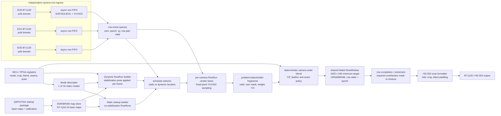

# EO Panorama V19 alternate architecture: source-driven shared RowWindow

Date: 2026-08-04

Project: `E:\Xylinx\EO_Panorama_V19_M1`

Status: design note reconstructed from the late 2026-07-21 architecture discussion and the subsequent V19 hardware evidence. This is not the currently implemented RTL baseline. It is the alternate architecture that should be used as a clean direction if the current DDR frame/ring/replay path continues to expose timing, bandwidth arbitration, or temporal-integrity artifacts.

---

## 1. Short answer

Yes, the alternate architecture conclusion is remembered at the concept level:

> Stop trying to force six unsynchronized BT.1120 camera rasters into one common live two-line moment. Instead, accept each camera row as it arrives, generate the source-row RowRuns for that camera row, render directly into a large shared post-render RowWindow in folded HD raster coordinates, and retire/output rows only when their required contributions are complete or deliberately timed out.

The key shift is from **input-domain alignment** to **output-domain accumulation**.

The current V19 direction tried to repair the original direct two-line model by writing camera frames into DDR and replaying aligned rows into the renderer. That is valid, but it creates a heavy DDR arbitration problem: six input writers, six source replay readers, output-frame writer, HD-SDI reader, and descriptor/epoch management all contend for the same native DDR interface. The alternate architecture uses a large on-chip shared RowWindow to absorb camera raster phase differences and to preserve the V19 source-row-bucket idea without first storing every camera frame in DDR.

---

## 2. Why this alternate architecture exists

The important hardware fact is now established:

- The EO cameras can expose from a common trigger/strobe epoch.
- The manufacturer confirmed that they do **not** provide synchronized BT.1120 output timing.
- Therefore, frame exposure synchronization and raster output synchronization are different problems.

The original Milestone-1 two-line cache model assumed that all six cameras present approximately the same source row at approximately the same time. Hardware captures showed that this is not guaranteed. The later DDR ring/replay architecture decouples the rasters by buffering complete camera frames in DDR, but then the design becomes dominated by:

- camera capture FIFO pressure;
- DDR write/read arbitration;
- immutable bank leasing;
- frame/content epoch matching;
- output scan starvation;
- stale-bank or mixed-epoch artifacts during motion.

The alternate architecture asks a different question:

> Since the V19 algorithm is reverse-map/source-row driven, do we actually need to align camera input rasters before rendering?

The conclusion was: **not necessarily**. If a row from camera 3 arrives now, the RowRun math can tell us exactly which destination panorama/folded rows and columns that source row contributes to. So the row can be rendered immediately into its destination locations, even if camera 1 is currently at a different source row.

That requires a sufficiently deep shared RowWindow, but it can remove the need for full per-camera input DDR frame buffers in the common case.

---

## 3. Architectural principle

The architecture is source-row driven:

```text
camera row arrival -> source-row bucket / RowRun generation
                   -> per-camera render fragment
                   -> deterministic blend/accumulate into shared RowWindow
                   -> row-ready retirement
                   -> direct HD-SDI scan/fold output
```

It is not destination-row pull driven:

```text
destination row asks for six cameras' current rows -> stall until all six match
```

The second form is what creates the synchronization trap. The first form uses the mathematical property of the RowRun representation: a source row pair can enumerate the output fragments that depend on it.

---

## 4. High-level block diagram



The diagram intentionally shows only three camera boxes for readability; the RTL architecture uses six EO lanes.

---

## 5. Shared RowWindow sizing

The discussed practical target was a **shared folded RowWindow of 1920 x 540 YUV422 pixels**, not six separate full RowWindows.

Why 1920 x 540:

- It matches the HD raster width.
- It is large enough to support the single-camera undistorted modes that need a 1920-wide folded/field-sized active area.
- It can absorb approximately a half-frame of row phase difference, which matches the observed order of EO BT.1120 raster phase spread.
- It is far smaller than six per-camera frame buffers.
- It can remove the external DDR output-frame ping-pong for modes whose scan-out can be served directly from the completed RowWindow rows.

Approximate memory estimates, assuming final YUV422 pixels only:

| Window | Pixels | Bytes at YUV422 | Approx. URAM288 minimum |
|---|---:|---:|---:|
| Original `ACTIVE_BUFFER=180`, panorama-width rows | 3840 x 180 | 1,382,400 B | 38 URAM |
| Folded half-raster RowWindow | 1920 x 540 | 2,073,600 B | 57 URAM |
| Full panorama frame | 3840 x 480 | 3,686,400 B | 100 URAM |
| Full 1080p folded frame | 1920 x 1080 | 4,147,200 B | 113 URAM |

These numbers are lower bounds. A real accumulator may also need:

- per-row epoch tags;
- per-row completion bitmasks;
- per-pixel or per-run valid masks;
- blend weights or accumulated weight;
- optional wider internal luma/chroma accumulation before final clipping.

Therefore the safer conclusion is:

- **1920 x 540 final-pixel RowWindow is comfortable.**
- **3840 x 480 final-pixel RowWindow is possible but consumes most URAM if implemented entirely on chip.**
- **Full 1920 x 1080 direct-scan frame storage is possible only if the rest of the design is moved away from BRAM pressure and the RowWindow metadata is kept compact.**

For a first implementation, use 1920 x 540 as the deployable target and keep the design able to fall back to DDR output banking if row-ready timing cannot satisfy HD-SDI scan order in every mode.

---

## 6. How this removes the input DDR ring in the common path

The DDR ring/replay architecture does this:

```text
camera row -> DDR camera frame/ring -> later aligned DDR replay -> two-line cache -> renderer
```

The alternate architecture does this:

```text
camera row -> small async row FIFO -> RowRun builder -> renderer -> shared RowWindow
```

The input DDR ring is skipped because the design no longer needs to wait until all six cameras have the same source row resident. Each camera row is consumed when it arrives.

This works only if three contracts hold:

1. **Every source row event carries an epoch.**  
   The renderer must not blend camera 0 from trigger epoch N with camera 4 from trigger epoch N+1 in the same output row.

2. **The RowWindow is deep enough for the measured raster phase spread.**  
   If one camera is roughly 500 rows ahead of another, the destination rows touched by the leading camera must remain open until the lagging camera's contributions arrive, or the system must make a deliberate missing-camera/timeout decision.

3. **Row retirement is explicit.**  
   A row is not sent to HD-SDI just because it was written. It becomes scannable only when the schedule says all expected contributions are complete, or when a configured timeout/missing-camera policy closes the row.

The architecture therefore removes the *full-frame* input DDR ring, not all buffering. It still needs:

- small per-camera async FIFOs for CDC;
- one or two source-line buffers per active camera lane;
- a large shared RowWindow;
- row-state metadata.

---

## 7. Static mode versus stabilization mode

This is the most important design split.

### 7.1 Static / no-stabilization modes

For static modes, RowRuns can be generated once at startup:

```text
base maps / distortion maps -> startup RowRun generator -> compact source-row buckets
```

At runtime:

```text
incoming cam sy -> read bucket[mode][cam][sy] -> render listed destination runs
```

This is efficient and deterministic. It also supports:

- EO panorama no stabilization;
- EO single undistorted modes;
- IR single/stack modes if corresponding static maps exist;
- blend/overlap policy from FPGA registers.

The on-disk base maps are only about 2 MB, but the fully expanded RowRun pool can be much larger. The startup-generated RowRun representation should therefore be compact and organized by:

```text
mode -> camera -> source_y -> list of RowRuns
```

The runtime reads only active buckets.

### 7.2 Stabilization-enabled panorama

For stabilization, full RowRuns cannot be completely precomputed at startup because the IMU/AHRS pose changes per frame:

```text
base map + frame pose c15/s15/dy -> corrected coordinates -> RowRun buckets
```

The dynamic case still should not become random per-pixel DDR access. The better split is:

- precompute static **row influence envelopes** per mode/camera/source row;
- at runtime, use the current pose to refine the RowRuns only inside those envelopes;
- burst-read base-map/map rows or tiles into a small row/tile cache;
- generate RowRuns for each camera's arriving source row pair independently;
- feed those generated runs into the same renderer/blender/RowWindow path as static mode.

This means dynamic stabilization may issue map-row requests for different cameras and different source rows at the same time. That is no longer the clean "all six cameras read the same map row" pattern. It is manageable if map access is row/tile cached and scheduled, but it must be designed explicitly.

The dynamic builder should be treated as a real client of the memory/QoS system, not as a combinational afterthought.

---

## 8. Map access implication

The important question from the discussion was:

> If each camera is on a different source line, will dynamic RowRun generation require random map access?

Answer:

Not random per pixel, but yes, it can become **non-uniform row/tile access** if left unmanaged.

For static modes, the runtime does not need base-map reads at all after startup; it reads compact RowRun buckets.

For dynamic stabilization, the runtime needs map data because the pose changes. The architecture should therefore use one of these mechanisms:

### Option A: per-camera map row cache

Maintain a small cache of recently requested base-map rows per camera. When camera `i` emits source row `sy`, the dynamic builder requests map row/tile `(i, sy)` and `(i, sy+1)` if not already cached. DDR accesses remain burst-like because each map row/tile is contiguous.

This is simplest and robust against independent camera raster phases.

### Option B: precomputed row-envelope + dynamic correction

At startup, generate compact metadata:

```text
for each mode, camera, source row:
    affected destination y range
    x span/chords
    base-map offset range
    conservative blend/camera mask
```

At runtime, the dynamic builder applies frame pose only inside that bounded envelope. This reduces dynamic search and keeps memory access predictable.

### Option C: periodic dynamic schedule prebuild

For slowly varying stabilization, build the next frame's dynamic source-row buckets during the current frame and store them in a double-buffered schedule RAM/DDR region. This reintroduces a schedule-buffer step but not a full input-frame ring. It trades a small extra frame of control latency for deterministic renderer timing.

This option is safest if the dynamic builder is too heavy to run inline at camera-row rate.

---

## 9. RowWindow row state and blending

The RowWindow is not just pixel memory. Each row slot should carry state:

```text
row_epoch
folded_y
valid_pixel/range mask or run-completion mask
required_camera_mask
contributed_camera_mask
blend_done / row_ready
timeout / missing_camera flags
```

The rendering lane writes **preblend placeholder fragments** first:

```text
{folded_y, x0, len, cam_id, epoch, Y/C samples, alpha/weight}
```

The deterministic merge/blend unit then updates the shared RowWindow in a fixed camera order. This preserves the planned V19 behavior:

- six camera bucket-row render lanes before blending;
- per-camera preblend placeholders;
- deterministic Y/C feathering and seam policy;
- FPGA-register-controlled blend regions and weights;
- no per-camera full RowWindow duplication.

The row is eligible for retirement when:

```text
(contributed_camera_mask & required_camera_mask) == required_camera_mask
```

or when the selected mode's timeout/missing-camera policy explicitly closes it.

---

## 10. HD-SDI output policy

The original deployed output path was:

```text
3840 x 480 panorama -> fold to 1920 x 960 -> black pad rows 960..1079
-> DDR ping-pong frame -> HD-SDI reads opposite bank
```

The alternate architecture changes that to:

```text
render into folded RowWindow -> scan ready rows directly to HD-SDI formatter
```

For panorama:

- folded rows 0..479 hold panorama left half;
- folded rows 480..959 hold panorama right half;
- rows 960..1079 are black padding.

For single-camera undistorted modes:

- the active window can use the same 1920-wide RowWindow fabric;
- crop/scale/black-pad policy comes from the mode descriptor and FPGA registers.

Important caveat:

Skipping external DDR output ping-pong is safe only if the RowWindow can guarantee row readiness before scan-out needs that row. If a mode can violate that, the architecture should keep one of these fallbacks:

- two on-chip RowWindow banks/fields;
- a small on-chip scan FIFO plus row-hold policy;
- external DDR output bank for that mode only.

So the correct phrasing is:

> The 1920 x 540 shared RowWindow can remove the mandatory DDR output ping-pong for the common folded/field-at-a-time path, but the RTL must still protect HD-SDI scan-out from reading rows that are actively being written or not yet complete.

---

## 11. Mode scalability

The architecture is mode-scalable because the expensive memory object is shared.

The 16-mode system should be represented by mode descriptors, not separate datapaths:

```text
mode_id
source_family: EO / IR
source_count: 1 / 2 / 6
camera_select_mask
map_family: identity / undistort / panorama / stabilization
static_or_dynamic_schedule
output_layout: single / stack / panorama-fold
active_width, active_height
crop and black-pad policy
blend/seam enable
missing-camera policy
```

EO panorama is the worst case for:

- number of sources;
- blending;
- row contribution masks;
- aggregate write rate into the RowWindow;
- map/schedule complexity.

Single EO/IR modes reuse the same RowWindow and output formatter with:

- `source_count=1`;
- blend disabled;
- only one camera contribution required per output row;
- simpler static RowRuns or identity/undistort maps.

This is why a shared RowWindow architecture is expandable: it spends memory once, then uses descriptors to reduce the active clients for simpler modes.

---

## 12. Latency model

The DDR ring/replay architecture has at least these latency components:

```text
camera raster phase skew
+ frame/ring write completion or row availability
+ descriptor/epoch selection
+ DDR replay latency to feed two-line cache
+ render/fold/write to output frame
+ wait for HD-SDI to scan the committed bank
```

The alternate architecture removes the full-frame input-ring and replay terms:

```text
camera row arrival
+ map/RowRun generation latency
+ render/blend latency
+ wait until row contributions complete
+ wait until HD-SDI scan reaches the row
```

For static modes, map/RowRun generation latency is essentially just bucket read latency.

For stabilization, dynamic RowRun generation adds map-row/tile-cache latency. This should be hidden by:

- queueing incoming row events;
- maintaining per-camera map row caches;
- keeping a large RowWindow so early camera rows do not expire while later cameras arrive;
- optionally prebuilding the next frame's dynamic schedule if inline generation is too tight.

The dominant latency becomes the physical camera raster phase skew plus HD-SDI scan position, not a compulsory extra DDR frame.

---

## 13. Throughput and memory-bandwidth impact

### Removed or reduced traffic

The alternate architecture can remove:

- six full camera-frame DDR writes per frame;
- six aligned source-row DDR replay reads per frame;
- external DDR output-frame writes for modes that scan directly from the RowWindow;
- external DDR output-frame reads for those same modes.

That substantially reduces pressure on the DDR4 native interface.

### Added traffic

The alternate architecture adds or increases:

- map-row/tile reads for dynamic stabilization;
- RowRun bucket reads for static modes;
- on-chip RowWindow write/read bandwidth;
- optional schedule-buffer writes if dynamic schedules are prebuilt.

The trade is favorable because RowWindow traffic is on-chip and RowRun/map accesses are compact or burstable, while full camera-frame DDR traffic is large and time-critical.

---

## 14. RTL implementation sketch

Recommended module split:

```text
EoV19CamRowIngress
    pclk -> ui_clk async FIFO with row/event metadata

EoV19ModeDescriptorRegs
    active mode, camera mask, crop/fold, blend, timeout, pose

EoV19StaticBucketReader
    startup-generated source-row RowRun buckets

EoV19DynamicRowRunBuilder
    pose-corrected row/tile map reader and RowRun generator

EoV19ScheduleSelector
    selects static bucket or dynamic builder output per mode

EoV19RenderLane[0..5]
    fixed-point bilinear YUV422 row-pair sampling

EoV19PreblendFragmentFifo[0..5]
    camera-local fragments before deterministic merge

EoV19BlendMerge
    fixed camera order, alpha/seam policy, Y/C handling

EoV19FoldedRowWindow
    1920 x 540 target storage plus row-state metadata

EoV19RowRetire
    completion masks, epoch checks, timeout/missing-camera policy

EoV19DirectScanFormatter
    HD raster scan, black padding, optional DDR fallback
```

The first bring-up should implement static/no-stabilization mode only. Dynamic stabilization should be added after the RowWindow, static buckets, row retirement, and direct scan-out are proven.

---

## 15. Verification strategy

Simulation should come before another long hardware loop.

### Required testbench behavior

- six camera generators with independent raster phases;
- randomized static skew up to and beyond 540 rows;
- optional slow drift;
- trigger/content epochs;
- static RowRun bucket model;
- dynamic map-row request model;
- HD-SDI scan consumer;
- missing-camera and timeout cases.

### Assertions

1. A RowWindow pixel never blends contributions from different epochs.
2. A row is never scanned before it is ready, except by explicit timeout policy.
3. No camera contribution overwrites a row belonging to a different output epoch.
4. Static mode reads only buckets belonging to the arriving source row.
5. Dynamic mode never issues per-pixel map reads; accesses are row/tile burst requests.
6. For `source_count=1`, the same RowWindow path produces EO/IR single mode output with blend disabled.
7. With skew less than the configured window depth, no valid contribution is dropped.
8. With skew greater than window depth, the result is a flagged timeout/missing-camera row, not tearing.

### Hardware bring-up order

1. Single camera identity into folded RowWindow.
2. Single camera undistort static RowRuns.
3. Six camera static panorama with blending disabled.
4. Six camera static panorama with deterministic blend enabled.
5. Direct HD-SDI scan from RowWindow.
6. Add timeout/missing-camera behavior.
7. Add dynamic stabilization RowRun builder.
8. Add optional DDR fallback for modes that cannot meet direct scan timing.

---

## 16. Risks and open decisions

### 16.1 Is 1920 x 540 enough?

It is enough only if measured camera raster phase spread plus processing margin fits inside the window policy. Earlier measurements showed spreads in the hundreds of lines. A 540-line RowWindow is plausible, but it should be treated as a design parameter:

```text
ROW_WINDOW_H = 540 initially
increase or fallback to DDR if measured skew + margin exceeds ROW_WINDOW_H
```

### 16.2 Can direct scan-out always replace DDR ping-pong?

Not automatically. Direct scan-out needs row-ready timing. If HD-SDI demands row `r` before all expected camera contributions have arrived, the system must either:

- delay by using a larger/two-bank RowWindow;
- output a flagged timeout row;
- or use DDR output ping-pong for that mode.

### 16.3 Dynamic stabilization map access

This is the main complexity. Static RowRuns are straightforward. Dynamic stabilization needs a row/tile map cache and a RowRun builder that can handle independent camera row arrivals.

### 16.4 Accumulator format

Final YUV422 storage is compact. True weighted accumulation may need wider internal fields. A practical compromise:

- preblend fragments carry full precision briefly;
- merge unit writes final clipped YUV422 into RowWindow;
- row/run metadata stores completion, not per-pixel weights, whenever deterministic blend order permits.

If arbitrary multi-camera weighted accumulation is required per pixel, memory can grow enough to make DDR fallback necessary.

---

## 17. Recommended conclusion

This alternate architecture is scientifically and architecturally coherent:

- It respects the camera manufacturer's statement that BT.1120 rasters are not synchronized.
- It preserves the V19 source-row RowRun concept.
- It avoids full per-camera input DDR buffering in the common path.
- It creates a shared memory architecture that naturally expands to all 16 modes.
- It makes EO panorama the worst-case mode and lets simpler EO/IR modes reuse the same memory and output fabric.

The recommended next step is not to jump straight into RTL. First, write a compact simulator for the source-driven RowWindow with six independently phased camera row streams. If the simulator proves that `ROW_WINDOW_H=540` survives measured skew plus margin, implement the static/no-stabilization mode in RTL. Then add dynamic stabilization map-row caching and RowRun generation as the second phase.

